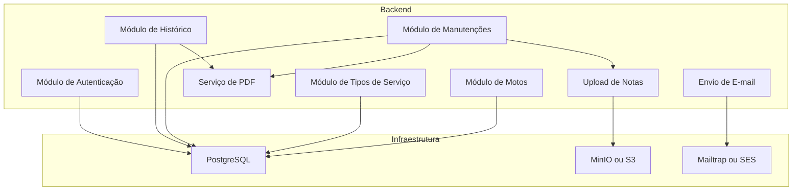
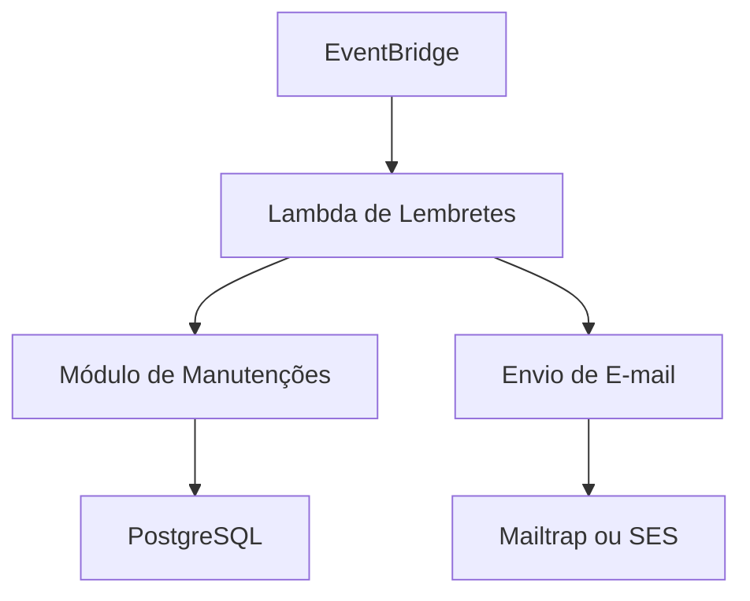

# Documento de Design de Alto Nível (HLD)

## Nome do Projeto
MotoTrack

## Data
2026-01-06

## Objetivo Técnico
Desenvolver uma aplicação web para controle de manutenções periódicas de motocicletas, permitindo:

- Cadastro de motos
- Cadastro de tipos de serviço com periodicidade
- Registro de manutenções (com upload de notas fiscais)
- Geração de PDF de manutenções e histórico
- Envio automático de lembretes por e-mail

A arquitetura deve ser modular, dockerizada e refletir práticas modernas com integração ao ecossistema AWS. Em ambiente de desenvolvimento, serviços AWS serão simulados via LocalStack, Minio e Mailtrap.

---

## Componentes Principais

- **Frontend (Vue 3 SPA)**
- **Backend (FastAPI - Python)**
- **Banco de Dados (PostgreSQL)**
- **Armazenamento de Arquivos (MinIO / AWS S3)**
- **Serviço de E-mail (Mailtrap / AWS SES)**
- **Geração de PDF (HTML → PDF em memória)**
- **Agendamento de tarefas (AWS EventBridge + Lambda via LocalStack)**
- **Autenticação simples (login com e-mail e senha)**
- **Testes Automatizados**
- **Ambiente Dockerizado com Docker Compose**

---

## Fluxos Principais

### 1. Login
- Login simples com e-mail e senha (armazenada com hash no banco)

### 2. Cadastro de Moto
- Dados enviados via frontend para API
- Salvo no banco de dados

### 3. Cadastro de Tipos de Serviço
- Nome e periodicidade (tempo/km) armazenados

### 4. Registro de Manutenção
- Múltiplos serviços por manutenção
- Upload de notas fiscais (MinIO / AWS S3)
- Geração de PDF da manutenção (retornado para download)
- Agendamento do próximo serviço

### 5. Histórico de Manutenções
- Visualização e exportação em PDF

### 6. Lembretes Automáticos
- Lambda verifica manutenções com vencimento próximo
- Envia e-mail via Mailtrap ou SES

---

## Diagrama 1: Componentes Principais

---

## Diagrama 2: Agendamento de Lembretes

---

## Decisões Técnicas

- **Backend**: FastAPI com suporte a Swagger/OpenAPI.
- **Frontend**: Vue 3 com SPA responsiva.
- **Banco de Dados**: PostgreSQL com Docker.
- **Geração de PDF**: `WeasyPrint` ou `pdfkit` a partir de HTML/CSS.
- **Armazenamento de Arquivos**: MinIO (local) com compatibilidade com AWS S3.
- **Serviço de E-mail**: Mailtrap (dev), AWS SES (prod).
- **Agendador de Lembretes**: AWS EventBridge + Lambda, usando LocalStack localmente.
- **Autenticação**: Login básico, com senha criptografada (bcrypt).
- **Testes**: `pytest` no backend; testes de unidade no frontend.
- **Infraestrutura**: Docker Compose para todos os serviços locais.

---

## Considerações Finais

MotoTrack é um projeto de aprendizado com foco em boas práticas, arquitetura escalável e uso realista de ferramentas modernas. Este HLD serve como base para as fases de implementação e documentação técnica futura (ADRs, FDRs, etc).
